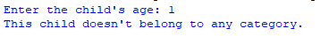

## Description
This program prompts the user to enter a child's age and categorizes it into one of the following age groups:  
- "Youngster" (6-7 years old)
- "Pupil" (8-9 years old)
- "Junior" (10-11 years old)
- "Cadet" (12 years and older)  
- If the entered age doesn't fall into any of these categories, it informs the user that the child doesn't belong to any category.
## Example 
♡ Example 1  
  
♡ Example 2  

